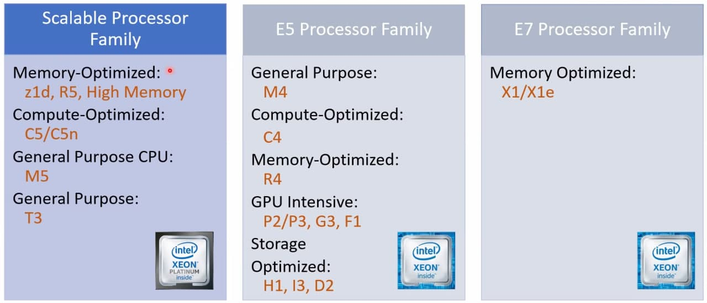

# AWS Technical Essentials

_Attended 2 March 2021_

- Core infrastructure and services
  - Security
    - Security groups: set of firewall rules that control the traffic for your instance. default to nothing allowed to come in
    - Network ACLs: firewall at subnet level (allow, deny)
    - AWS IAM
  - Networking
    - Elastic Load Blanacing
    - VPC
  - Servers
    - AMI
    - Amazon EC2 instances
  - Storage and Database
    - Amazon EBS: Virtual hard drive
    - Amazon EFS: File server in the cloud
    - Amazon S3: Simple storage service
    - Amazon RDS
- Global Infrastructure
  - Regions
    - Geographic locations
    - Consist of at least two Availability Zones (physically distinct groups of data centers within a region)
    - Each AZ is isolated, but the AZs in a region are connected through low-latency links, to provide high availability
    - Even if you pick us-east-1a, it might be different from other people's 1a. But your 1a will never change.
  - Edge locations: local points of presence to support AWS services like Amazon Route 53, CloudFront, WAF, Shield
- Elastic Compute Cloud (EC2)
  - Resizable compute capacity
  - Pay for capacity you provisioned
  - Families
    
    - General purpose
    - Compute-optimised
    - Memory-optimised
    - Accelerated computing
    - Storage-optimised
  - Creating an instance
    - User data: start-up script
    - Hibernation takes a snapshot of the currently running system and writes to disk, so when you restart, it can be done very quickly. Only charged for elastic IP and EBS volumes when hibernated
    - Can only give name after creation
  - Only EBS backed instances can be "stopped". Ephemeral instances will be deleted when stopped (e.g. cache)
  - Instance metadata: settings related to your instance
    - To view all categories of instance metadata from within a running instance: `<some ip>/latest/meta-data/`
    - Can get its private and public IP addresses
  - Instance User Data
    - Can be passed to instance at launch
    - Can be used to perform common automated configuration tasks
    - Runs scripts after the instance starts (once per instance ID)
  - Payment types
    - On-demand instances
    - Reserved instances
    - Scheduled instances
    - Spot instances: bid on unused instances, instance is available when there is unused instance and your bid is above spot price. Useful for experimentation, jobs which don't have hard deadline
    - Dedicated instances: single-tenant hardware, useful for sensitive data
    - Dedicated hosts: physical host fully dedicated to running your instances, useful for licensing
  - EC2 Instance storage: local
- Amazon Machine Image (AMI): Template that contains the software configuration (OS, app server, applications) required to launch your instance
  - AWS Marketplace: vetted by AWS, more likely to be safe
  - Community
- Tags can help you search for resources
- Amazon VPC: provision a private, isolated virtual network on the AWS cloud
  - Have complete control over your virtual networking environment
  - Subnet: defines a range of IP addresses in your VPC, partitions the VPC so we can control network traffic
  - You can launch AWS resources into a subnet
  - Private subnet: for resources that won't be accessible over the internet. Defined by whether subnet has access to internet gateway
  - Public subnet: resources that will be accessed over internet
  - Each subnet must reside entirely within one AZ and cannot span zones
  - Additional layer of security at subnet level: Network ACL
  - Security at instance level: Security Group
- Amazon S3: Storage for the internet
  - HTTP access
  - Object key is the unique identifier for an object in a bucket
  - There are no sub-buckets or sub-directories. When creating a directory in a bucket, it is just adding a prefix
  - Deleting deleted objects (list versions to see) undeletes them
- Amazon Glacier: Long term low-cost archiving service for infrequently accessed storage
- Amazon Elastic Block Store (EBS): virtual hard drive
  - Lifecycle
    1. Create volume
    2. Attach volume to EC2 instance
    3. Format from Amazon EC2 instance OS, mount formatted drive
    4. Snapshot to Amazon S3
    5. Detach volume
    6. Delete volume
  - Types
    - General Purpose SSD: good for boot disks
    - Provisioned IOPS SSD: good for data disks
    - Throughput Optimised HDD: good for streaming data onto the disk then back again
    - Cold HDD: slow disks
  - Each volume can only be in a single AZ
  - Generally each volume is only attached to one EC2 instance
- AWS shared responsibility model
  - AWS is responsible for the security of the cloud; customers are responsible for security in the cloud
- AWS IAM
  - User can belong to multiple groups, useful for providing different access to different teams
  - Roles are sets of permissions (through policies) that can be assumed by IAM users, applications and services
    - No need to store credentials in services
    - Can assume role from different AWS account
    - Assuming role generates temporary Security Credentials (AWS STS)
      - Session: access key ID, secret access key, session token, expiration
        - Use cases: cross-account access, federation, mobile users, key rotation for Amazon EC2-based apps
  - Best practices
    - Delete AWS account (root) access keys
    - Create individual IAM users
    - Use groups to assign permissions to IAM users
    - Grant least privilege
    - Configure a strong password policy
    - Enable MFA for privileged users
    - Use roles for applications that run on EC2 instances
    - Delegate by using roles instead of by sharing credentials
    - Rotate credentials regularly
    - Remove unnecessary users and credentials
    - Use policy conditions for extra security
    - Monitor activity in your AWS account
- CloudTrail
  - Records AWS API calls for accounts
  - Delivers log files with information to a S3 bucket
- Databases
  - Products
    - RDS: Relational db with minimal administration. Can choose which database engine, scale compute and storage, multi-AZ availability
      - Automatic backups or manual snapshots (for durability of data retention)
      - Can do cross-region snapshots
      - Multi AZ deployments to ensure availability
      - Best practices
        - Monitor memory, CPU and storage usage
        - Use Multi-AZ deployments to automatically provision and maintain a synchronous standby in a different AZ
        - Enable automatic backuops
        - Set backup window to occur during daily low in Write IOPS
        - To increase the I/O capacity of a DB instance:
          - Migrate to a DB instance class with high I/O capacity
          - Convert from standard storage to Provisioned IOPS storage and use a DB instance class optimised for Provisioned IOPS
          - Provision additional throughput capacity (if using Provisioned IOPS storage)
        - ...
      - DB instance is the basic building block of Amazon RDS
        - Can have multiple dbs in a db instance
        - If you need a db you can manage on your own, spin up EC2 instance and choose the corresponding AMI
      - DB Subnet group tells RDS which subnets can be used for the database. Each subnet group must consist of subnets in at least 2 AZs
    - Dynamodb: Fast, highly scalable NoSQL database service with extremely fast perfromance, seamless scalability and reliability and low cost
      - Partition key and sort key make up primary keys (unique)
        - Sorted index maintained for both keys
        - Choosing good partition key is important for scalability
    - To choose, consider:
      - Data formats, size, query frequency, data access speed, data retention period
    - Aurora: AWS implementation of RDS
    - ElastiCache: not really a database, it's for caching, keeping data in memory. There is also a version that writes to disk
    - Redshift: Data warehousing
    - Neptune: Graph database
- Triad of services
  - How it works
    1. CloudWatch can collect information about latency from ELB, and utilisation from the auto scaling group (ELB over it).
    2. When Cloudwatch senses the machines become too slow (alarms), it can send execute scaling policty to Auto Scaling, which then spins up new EC2 instance in the auto scaling group.
    3. Then it lets ELB know so it can start distributing load to the new instance too
  - ELB: distributes traffic across multiple EC2 instances in multiple AZs
    - Supports health checks to detect unhealthy EC2 instances
    - HTTP, HTTPS, SSL, TCP traffic
    - Types: https://docs.aws.amazon.com/AmazonECS/latest/developerguide/load-balancer-types.html
  - Auto Scaling: scale EC2 capacity automatically
    - Well-suited for applications that experience variability in usage
    - Launch configuration: template that an Auto Scaling group uses to launch EC2 instances
      - Can specify: AMI ID, instance type, key pair, security groups, block device mapping, user data
    - Auto Scaling Groups: collection of EC2 instances that share similar characteristics
      - Instances in the group are treated as logical grouping for the purpose of instance scaling and management
      - Min size, desired capacity, max size (e.g. for cost savings, don't enable DDOS)
    - Can also have scheduled actions or scaling policy
